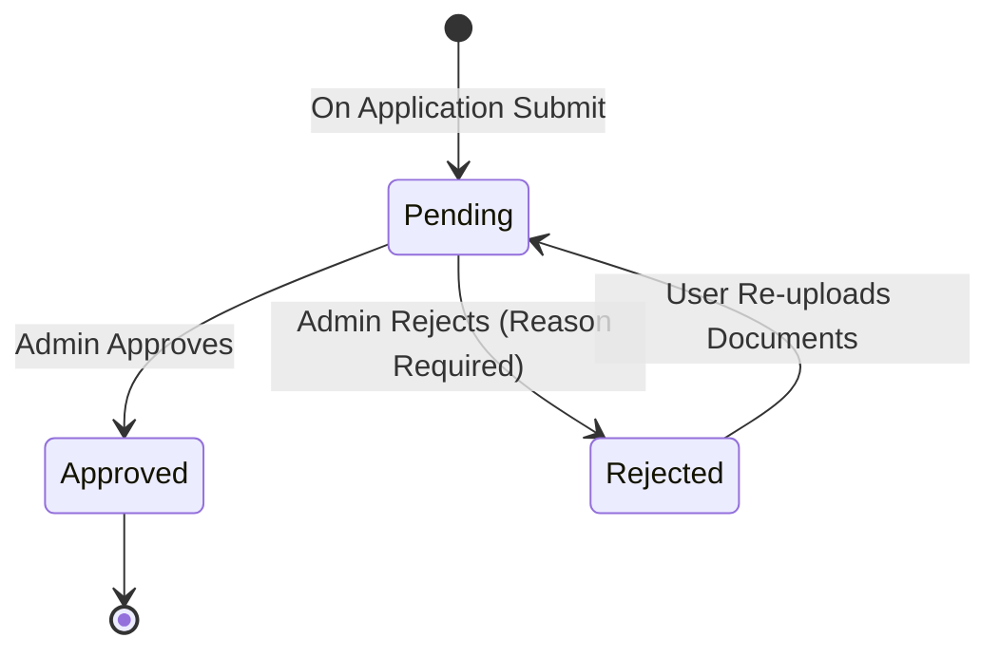

# Data Model: Mentor Verification & Directory

## Entities

### MentorProfile

Represents the extended profile for a user with the `MENTOR` role.

| Field | Type | Required | Description |
|-------|------|----------|-------------|
| `userId` | `string` | Yes | Foreign Key to `User.id`. Primary Key for this collection. |
| `status` | `enum` | Yes | `PENDING` \| `APPROVED` \| `REJECTED`. Default: `PENDING`. |
| `university` | `string` | Yes | Name of the university (e.g., "Hongik Univ"). |
| `major` | `string` | Yes | Major/Department. |
| `styleTags` | `string[]` | Yes | List of art styles (e.g., ["Watercolor", "Design"]). |
| `intro` | `string` | Yes | Short introduction/bio. |
| `verificationDocs` | `VerificationDoc[]` | Yes | List of uploaded documents. |
| `rejectionReason` | `string` | No | Required if status is `REJECTED`. |
| `createdAt` | `string` | Yes | ISO Date string. |
| `updatedAt` | `string` | Yes | ISO Date string. |

### VerificationDoc

Value object for uploaded files.

| Field | Type | Required | Description |
|-------|------|----------|-------------|
| `id` | `string` | Yes | Unique ID for the file. |
| `name` | `string` | Yes | Original filename. |
| `url` | `string` | Yes | URL to access the file (placeholder in mock). |
| `uploadedAt` | `string` | Yes | ISO Date string. |

## Relationships

- **User (1) --- (1) MentorProfile**: A User with role `MENTOR` has exactly one MentorProfile.
- **MentorProfile (1) --- (N) VerificationDoc**: A profile can have multiple documents.

## State Transitions

### Mentor Status

